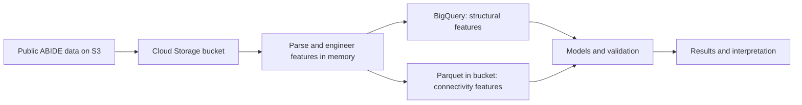
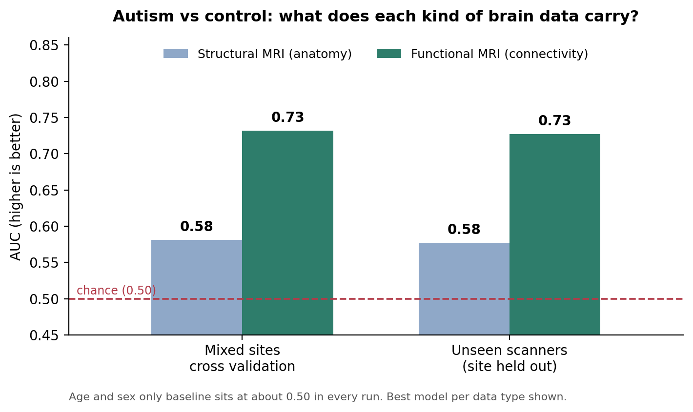

<div align="center">

# 🧠 NeuroScope

### Does the brain's *wiring* tell us more about autism than its *shape*?

A cloud data pipeline that puts **structural MRI** and **functional MRI** through the same leakage safe test, on the same people.


</div>

---

## 🔎 At a glance

| | |
|---|---|
| ❓ **Question** | Which kind of brain imaging carries a measurable, reproducible signal related to an autism diagnosis? |
| 📦 **Data** | ABIDE I: 1,035 participants with imaging, 17 scanning sites (open data) |
| 🏁 **Headline** | Anatomy alone: AUC about **0.58**. Functional connectivity: about **0.73**, and it holds on scanners the model never saw |
| ☁️ **Stack** | Python, Google Cloud Storage, BigQuery, Parquet, scikit learn, SHAP |
| ⚠️ **Scope** | A research and engineering project. **Not** a screening or diagnostic tool |

---

## 💡 Why this project exists

Autism is diagnosed from behavior, through clinical observation and structured interviews. There is no scan or blood test that confirms it. At the same time, large open datasets now exist where the same people were scanned with MRI and carefully labeled. That raised a practical question: if brain scans go through a proper data pipeline, is there a measurable signal that tracks with diagnosis, and if so, which kind of brain data carries it?

I started with **structural MRI** (the size and shape of brain regions) because it is the most common scan. After building a leakage safe pipeline with scanner correction and several model families, the signal stayed weak. Instead of tuning further, I changed the kind of data and added **resting state functional MRI**, which measures how brain regions work together. That change is what moved the result. This repository documents the whole path, including what did not work.

## 🎯 Goal

Measure whether brain imaging features carry a reproducible, **group level** signal related to autism diagnosis, and compare how much each imaging type carries. It is meant as a supporting, data driven layer for research, showing where signal does and does not exist.

1. ☁️ Build a reproducible cloud pipeline so raw data never sits on a laptop
2. 🧬 Engineer features from two imaging types
3. 🧪 Validate honestly: test on unseen scanners, and include an age and sex only baseline
4. 📊 Quantify the gap between structure and function
5. 🔍 Interpret what the models relied on, as associations only

---

## 🧭 Approach: two kinds of MRI, one pipeline

<table>
<tr>
<td align="center" width="50%">
<br>
<sub><b>Structural MRI</b>: the anatomy, a still picture of brain regions</sub>
</td>
<td align="center" width="50%">
<br>
<sub><b>Functional MRI</b>: brain activity over time (example activation map)</sub>
</td>
</tr>
</table>

| | 🧱 Structural MRI | 🔌 Functional MRI (resting state) |
|---|---|---|
| **Measures** | Thickness, area, volume of brain regions | How strongly regions' signals rise and fall together |
| **Tool that extracts it** | FreeSurfer (stats files) | C-PAC (region time series) |
| **Features per person** | about 377 | 19,900 connections |
| **Analogy** | A map of the roads | The traffic flowing on them |

*Our functional data is resting state connectivity (correlations between regions over time), not task activation. The image above only illustrates what fMRI output looks like.*

## 🏗️ Architecture



Files stream from S3 into the bucket through memory, so the roughly 4,000 raw files are never saved to a laptop.

---

## 🛠️ The phases: what we built, how we engineered features, what went wrong

| Phase | What we built | Feature engineering | Challenge and how we solved it |
|---|---|---|---|
| 📥 **1. Ingest** | S3 to Cloud Storage copy | n/a | Real file layout differed from the first guess (files sit per subject under `stats/`). Added a `--probe` mode to test URLs on 3 subjects first |
| 🧩 **2. Structural features** | Three FreeSurfer files per person parsed into one row, merged with clinical columns | Head size normalization, left versus right asymmetry indices, ComBat scanner correction | Values are read by column name, not position, and checked against raw files by hand (matched to 8 digits) |
| 🧱 **3. Structural models** | Logistic regression, random forest, gradient boosting, age and sex baseline | Correlation filter, optional feature selection, balanced class weights | Four different strategies stayed inside a narrow 0.52 to 0.58 band. The limit was the data, not the tuning. That is what triggered the pivot |
| 🔌 **4. Functional features** | Region time series turned into connectivity | Pairwise correlation, Fisher z transform, 19,900 connection features | Too wide for BigQuery's 10,000 column limit, so stored as Parquet. A laptop ran out of memory, fixed with float32 and a single worker |
| 📉 **5. PCA and models** | PCA then logistic regression, plus selection based variants | PCA or selection fitted inside each training fold | See the box below |
| ✅ **6. Validation** | Two schemes, mixed sites and unseen scanners | n/a | Whole scanner sites are held out of training, the strict test most quick projects skip |

> **📌 Why PCA?** With 19,900 features and about 1,000 people, a model can easily memorize noise. PCA compresses the connections into a few hundred components that capture the main patterns of variation. It is fitted on the training folds only, so test participants never influence it. PCA plus logistic regression turned out to be the best model.

---

## 🏆 Results

<div align="center">

</div>

| Data | Best model | Mixed sites AUC | Unseen scanners AUC |
|---|---|---|---|
| Age and sex only | Logistic regression | about 0.50 | about 0.51 |
| 🧱 Structural MRI (n = 920) | Harmonized, 60 features, logistic regression | 0.58 | 0.58 |
| 🔌 Functional connectivity (n = 1,035) | PCA plus logistic regression | **0.73** | **0.73** |

## 🔬 What we learned: why function beat structure

1. **Anatomy alone was not enough.** Region sizes differ only slightly between groups, buried under age, sex, and scanner variation. Harmonization, a cleaner subgroup, feature selection, and class weighting all hit the same ceiling.
2. **Function carries more.** Using the same pipeline and the same kind of validation, connectivity sits nearly three times further above chance (0.23) than anatomy (0.08). This is consistent with the idea that group differences lie more in how regions coordinate than in how large they are.
3. **It holds across scanners.** 0.727 on scanners never seen in training, against 0.732 on mixed sites.
4. **The baseline proves the brain data is doing the work.** Age and sex alone stay at about 0.50.

## ⚖️ What this does and does not show

✅ A group level association between functional connectivity and diagnosis that survives unseen scanners.

🚫 It is not a diagnosis. At the operating point, sensitivity and specificity are both about 0.66, so roughly one in three people in each group is misclassified. The top connections are model weights on noisy data, not established biomarkers.

## 🚧 Limitations

1. **Association, not causation or diagnosis**, in an open research cohort.
2. **The two cohorts differ slightly.** Structural uses 920 people after quality filtering and ComBat correction. Functional uses all 1,035 without either. The comparison is strong evidence, not a perfectly controlled experiment.
3. **ComBat cannot correct a scanner it never saw.** A held out site passes through unchanged.
4. **One dataset (ABIDE I) and older preprocessing** (FreeSurfer 5.1, C-PAC). No external validation yet.
5. **Functional results come from the fast tuning configuration.** A full grid run may shift them slightly.

---

## 🚀 Run it

<details>
<summary><b>Setup and commands</b></summary>

**Prerequisites:** Python 3.9 or newer, the Google Cloud CLI, and a GCP project with billing. Download `Phenotypic_V1_0b_preprocessed1.csv` from the [Preprocessed Connectomes Project repository](https://github.com/preprocessed-connectomes-project/abide) into `data/raw/`. Project, bucket, and table names live in `src/config.py`. GCP project IDs and bucket names are globally unique, so change them there if yours differ.

```bash
pip install -r requirements.txt
gcloud auth application-default login
gcloud config set project neuroscope26
gcloud storage buckets create gs://neuroscope26_data --location=us-east1
bq mk --dataset neuroscope26:abide

# Structural track
python src/01_download_freesurfer.py --probe
python src/01_download_freesurfer.py
python src/02_build_dataset.py
python src/03_train_evaluate.py --harmonize --select_k 60 --tasks classification

# Functional track
python src/04_download_fmri.py --probe
python src/04_download_fmri.py
python src/05_build_connectivity.py
python src/06_train_connectivity.py
```
Add `--fast` to either training script for a quick check. Keep `--jobs 1` (the default) on a laptop.

</details>

## 📁 Repository layout

```
neuroscope/
├── src/
│   ├── config.py                  cloud names in one place
│   ├── common.py                  ComBat, preprocessing, model definitions
│   ├── 01_download_freesurfer.py  S3 to Cloud Storage
│   ├── 02_build_dataset.py        parse stats files, features, BigQuery
│   ├── 03_train_evaluate.py       structural models, validation, SHAP
│   ├── 04_download_fmri.py        region time series into the bucket
│   ├── 05_build_connectivity.py   connectivity matrices to Parquet
│   └── 06_train_connectivity.py   functional models and validation
├── assets/
├── requirements.txt
└── README.md
```

**Built with:** Python, pandas, NumPy, scikit learn, SHAP, Google Cloud Storage, BigQuery, Parquet (pyarrow), matplotlib. ComBat is implemented from scratch so it can be fitted inside each training fold.

## 🖼️ Image credits

Structural MRI: *T1 weighted MRI*, public domain, via Wikimedia Commons. fMRI example: *Functional magnetic resonance imaging*, public domain, via Wikimedia Commons. Data: ABIDE I via the Preprocessed Connectomes Project.

---

<div align="center">

Built by **Dhrumil Patel** · a trial and error study of where brain imaging does, and does not, carry signal

</div>
